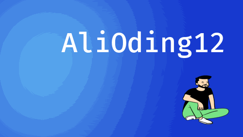
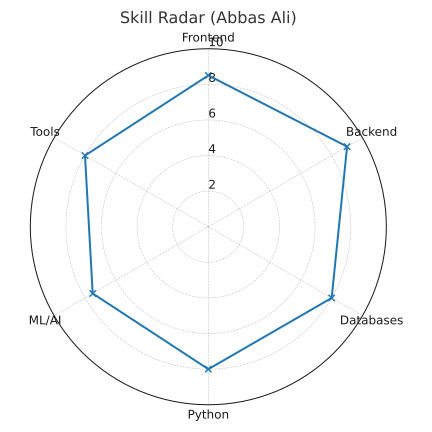

<!-- Top Banner -->

  

---
<!-- Two Rectangles Layout -->

<table>
<tr>
<td width="50%" align="center" valign="top">

<!-- About Me -->
<h2>About Me</h2>

<b>Abbas Ali</b>  

<ul>
  <li><b>Full-Stack Developer</b> with hands-on experience in building scalable web apps & enterprise MIS systems</li>
  <li>Worked on <b>AI & Deep Learning projects</b> — from <b>Computer Vision (CNNs, YOLO, U-Net)</b> to <b>Explainable AI</b></li>
  <li>Skilled in modern frameworks like <b>React, Angular, Next.js, Express, Flask, Django</b></li>
  <li>Experienced with <b>Databases</b> (PostgreSQL, MySQL, MongoDB, SQLite) and <b>data pipelines</b></li>
  <li>Love problem-solving with <b>C++</b> (Graphs, DSA) & creating optimized algorithms</li>
  <li>Always learning, always curious — diving deeper into <b>AI x Web Integration</b></li>
</ul>
<td width="50%" align="center" valign="top">

<!-- Stats -->
<h3>GitHub Stats</h3>

<!-- Circular Stats (Shields.io / GitHub Readme Stats) -->

  

</td>
</tr>
</table>

---

<!-- Contribution Graph -->

  

---
<!-- Tech Stack -->
<h3 align="center"></h3>

  

<!-- Frameworks & Libraries -->
<h4 align="center"> Frameworks & Libraries</h4>

  
  
  
  
  
  

<!-- Languages -->
<h4 align="center"> Programming Languages</h4>

  
  
  
  
  
  
  
  
  

<!-- Databases -->
<h4 align="center"> Databases</h4>

  
  
  
  

<!-- AI / ML -->
<h4 align="center"> AI / ML</h4>

  
  
  

<!-- Tools -->
<h4 align="center"> Tools & Others</h4>

  
  
  
  

---

<table>

 

  <tr>
    <td width="50%">

 

    </td>
    <td width="50%" align="center">
      <!-- Skill Radar -->
      
    </td>
  </tr>
</table>

---

  

 

  

  

  

  

---
<!-- Footer / Contact -->
---

<h2 align="center">Contact Me</h2>

  
  
  
  
  

---

